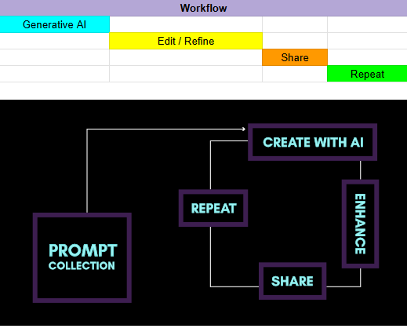

# Flashboys Make + Share Schema

You made it to our make and share schema aka flashboys starter pack. Most people don’t know how useful Open AI (ChatGPT) really is. The API does a lot more than what you see on the web UI. Our goal is to speed up your process, from making to sharing your work.

### Skim thru the project files:

```
| [assets]
|   |-- mainfesto.png
|   |-- workflow-diagram.png
| [manifesto]
|   |-- README.md
| [prompt-collection]
|   |-- README.md
|   |-- ···
| [script]
|   |-- .env.example
|   |-- README.md
|   |-- openai-api-quickstart.py
└──▶ README.md (you are here)
```

## Workflow


