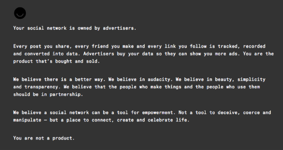

Back in 2014, Ello came out with their manifesto and got a massive amount of attention.

Unfortunately it did not last. Let's try something different.

It is now 2025, the creator economy has exploded. Generative AI and Vibe Coding is the ultimate equalizer. These new tools are not as horrifying as they think. The tools just need to be used properly which begins with prompting well.

> Pablo Picasso once said:
>
> "Every child is an artist. The problem is how to remain an artist once we grow up."

Create your unique piece of art. Do not let AI think for you. Use it as a high-powered assistant.

We will help you along the way. Join our Discord and ask questions.
